# IA626_TaxiProject_Amgarg

# FinalSubmission

### DATA Pre-Processing
The goal of this playground challenge is to predict the duration of taxi rides in NYC based on features like trip coordinates or pickup date and time. 
I have  taken Two datsets ie. Taxi Data and Taxi Fare which is more than 14M rows of data. I was not able to merge them because of the Hardware constraint in my laptop so I tried different technique:

1.  There are four field which are distinct i.e. Medallion, Hack_License, Vendor_ID, Pickup_Datetime. Then so the first method I tried using opening both the files and trying to use two nested for loops and merged data from these four field of a row and compared them with the another dataset with same process. Then I tried writing the data in new csv file.

2. I tried to use two dictionaries where in the key was a merged string with respective Medallion, Vendor_ID, Hack_License, Pickup_Datetime for both the dataset.

3. When i tried using the dictionary in the above technique I was storing rows in the value of the dictionary  as a list. Then I use set this worked but it rearranged the data which was not working for me.

4. Finally I Tried to remove the 'Prominent Null Values' i.e Medallion, Hack_license, Vendor_ID and Pickup_Datetime with that my dataset went down to 7M rows from 14M rows. Then I tried all the method above again but because of Hardware constraint it could not worked I could not complete this task.

5. So I Tried to reduce the datapoint so as to make things work according my System Specification, So I finally reduce the dataset around 1M rows and I merged them using Technique mentioned in Point 3.

### Data fields:

1. Medallion - Also known as a CPNC, is a transferable permit in the United States allowing a taxicab driver to operate.
2. Hack_License - Driver basically license
3. vendor_id - a code indicating the provider associated with the trip record
4. rate_code 
5. pickup_datetime - date and time when the meter was engaged
6. dropoff_datetime - date and time when the meter was disengaged
7. passenger_count - the number of passengers in the vehicle (driver entered value)
8. pickup_longitude - the longitude where the meter was engaged
9. pickup_latitude - the latitude where the meter was engaged
10. dropoff_longitude - the longitude where the meter was disengaged
11. dropoff_latitude - the latitude where the meter was disengaged
12. store_and_fwd_flag - This flag indicates whether the trip record was held in vehicle memory before sending to the vendor because the vehicle did not have a connection to the server - Y=store and forward; N=not a store and forward trip
13. trip_duration - duration of the trip in seconds
14. trip_time_in_secs
15. payment_type 
16. fare_amount 
17. surcharge
18. mta_tax 
19. tip_amount 
20. tolls_amount

### Loading Necessary Libraries
 ```python
import numpy as np #Linear Algebra
import pandas as pd #data processing
import geopandas as gpd
import seaborn as sns #Data Visualisation 
import matplotlib.pyplot as plt
import matplotlib.colors as colors
import datetime as dt
import warnings
warnings.filterwarnings("ignore")
```
### Importing Dataset
```python
df = pd.read_csv('NewTaxiProject.csv')
```
- we have our dataset which was of the type ‘csv’ in a pandas dataframe which we have named ‘df’.

## Exploring Dataset 
```python
df.shape
```
    (999976, 20)
- we see that shape of the dataset is (999976, 20) which essentially means there are 999976 rows and 20 columns in the dataset.

### Let's see what are those 12 columns:

## Data Head
```python
df.head()
```
<div>
<style scoped>
    .dataframe tbody tr th:only-of-type {
        vertical-align: middle;
    }

    .dataframe tbody tr th {
        vertical-align: top;
    }

    .dataframe thead th {
        text-align: right;
    }
</style>
<table border="1" class="dataframe">
  <thead>
    <tr style="text-align: right;">
      <th></th>
      <th>medallion</th>
      <th>hack_license</th>
      <th>vendor_id</th>
      <th>rate_code</th>
      <th>store_and_fwd_flag</th>
      <th>pickup_datetime</th>
      <th>dropoff_datetime</th>
      <th>passenger_count</th>
      <th>trip_time_in_secs</th>
      <th>trip_distance</th>
      <th>pickup_longitude</th>
      <th>pickup_latitude</th>
      <th>dropoff_longitude</th>
      <th>dropoff_latitude</th>
      <th>payment_type</th>
      <th>fare_amount</th>
      <th>surcharge</th>
      <th>mta_tax</th>
      <th>tip_amount</th>
      <th>tolls_amount</th>
    </tr>
  </thead>
  <tbody>
    <tr>
      <th>0</th>
      <td>89D227B655E5C82AECF13C3F540D4CF4</td>
      <td>BA96DE419E711691B9445D6A6307C170</td>
      <td>CMT</td>
      <td>1</td>
      <td>N</td>
      <td>2013-01-01 15:11:48</td>
      <td>2013-01-01 15:18:10</td>
      <td>4</td>
      <td>382</td>
      <td>1.0</td>
      <td>-73.978165</td>
      <td>40.757977</td>
      <td>-73.989838</td>
      <td>40.751171</td>
      <td>CSH</td>
      <td>6.5</td>
      <td>0.0</td>
      <td>0.5</td>
      <td>0.0</td>
      <td>0.0</td>
    </tr>
    <tr>
      <th>1</th>
      <td>0BD7C8F5BA12B88E0B67BED28BEA73D8</td>
      <td>9FD8F69F0804BDB5549F40E9DA1BE472</td>
      <td>CMT</td>
      <td>1</td>
      <td>N</td>
      <td>2013-01-06 00:18:35</td>
      <td>2013-01-06 00:22:54</td>
      <td>1</td>
      <td>259</td>
      <td>1.5</td>
      <td>-74.006683</td>
      <td>40.731781</td>
      <td>-73.994499</td>
      <td>40.750660</td>
      <td>CSH</td>
      <td>6.0</td>
      <td>0.5</td>
      <td>0.5</td>
      <td>0.0</td>
      <td>0.0</td>
    </tr>
    <tr>
      <th>2</th>
      <td>0BD7C8F5BA12B88E0B67BED28BEA73D8</td>
      <td>9FD8F69F0804BDB5549F40E9DA1BE472</td>
      <td>CMT</td>
      <td>1</td>
      <td>N</td>
      <td>2013-01-05 18:49:41</td>
      <td>2013-01-05 18:54:23</td>
      <td>1</td>
      <td>282</td>
      <td>1.1</td>
      <td>-74.004707</td>
      <td>40.737770</td>
      <td>-74.009834</td>
      <td>40.726002</td>
      <td>CSH</td>
      <td>5.5</td>
      <td>1.0</td>
      <td>0.5</td>
      <td>0.0</td>
      <td>0.0</td>
    </tr>
    <tr>
      <th>3</th>
      <td>DFD2202EE08F7A8DC9A57B02ACB81FE2</td>
      <td>51EE87E3205C985EF8431D850C786310</td>
      <td>CMT</td>
      <td>1</td>
      <td>N</td>
      <td>2013-01-07 23:54:15</td>
      <td>2013-01-07 23:58:20</td>
      <td>2</td>
      <td>244</td>
      <td>0.7</td>
      <td>-73.974602</td>
      <td>40.759945</td>
      <td>-73.984734</td>
      <td>40.759388</td>
      <td>CSH</td>
      <td>5.0</td>
      <td>0.5</td>
      <td>0.5</td>
      <td>0.0</td>
      <td>0.0</td>
    </tr>
    <tr>
      <th>4</th>
      <td>DFD2202EE08F7A8DC9A57B02ACB81FE2</td>
      <td>51EE87E3205C985EF8431D850C786310</td>
      <td>CMT</td>
      <td>1</td>
      <td>N</td>
      <td>2013-01-07 23:25:03</td>
      <td>2013-01-07 23:34:24</td>
      <td>1</td>
      <td>560</td>
      <td>2.1</td>
      <td>-73.976250</td>
      <td>40.748528</td>
      <td>-74.002586</td>
      <td>40.747868</td>
      <td>CSH</td>
      <td>9.5</td>
      <td>0.5</td>
      <td>0.5</td>
      <td>0.0</td>
      <td>0.0</td>
    </tr>
  </tbody>
</table>
</div>


Let us now look at the datatypes of all these columns.
### Data type
```python
df.dtypes
```
    medallion              object
    hack_license           object
    vendor_id              object
    rate_code               int64
    store_and_fwd_flag     object
    pickup_datetime        object
    dropoff_datetime       object
    passenger_count         int64
    trip_time_in_secs       int64
    trip_distance         float64
    pickup_longitude      float64
    pickup_latitude       float64
    dropoff_longitude     float64
    dropoff_latitude      float64
    payment_type           object
    fare_amount           float64
    surcharge             float64
    mta_tax               float64
    tip_amount            float64
    tolls_amount          float64
    dtype: object


- We have medallion, hack_license, vendor_id,store_and_fwd_flag, pickup_datetime, dropoff_datetime, and payment_type of the type ‘object’.
- Rate_code, passenger_count, and trip_time_in_secs are of type int.
- Trip_distance, pickup_longitude, pickup_latitude, dropoff_longitude,dropoff_latitude, fare_amount, surcharge, mta_tax, tip_amount, tolls_amount are of type float.

Now, Let us look how does the data table look like:

### Data Describe
```python
df.describe()
```
<div>
<style scoped>
    .dataframe tbody tr th:only-of-type {
        vertical-align: middle;
    }

    .dataframe tbody tr th {
        vertical-align: top;
    }

    .dataframe thead th {
        text-align: right;
    }
</style>
<table border="1" class="dataframe">
  <thead>
    <tr style="text-align: right;">
      <th></th>
      <th>rate_code</th>
      <th>passenger_count</th>
      <th>trip_time_in_secs</th>
      <th>trip_distance</th>
      <th>pickup_longitude</th>
      <th>pickup_latitude</th>
      <th>dropoff_longitude</th>
      <th>dropoff_latitude</th>
      <th>fare_amount</th>
      <th>surcharge</th>
      <th>mta_tax</th>
      <th>tip_amount</th>
      <th>tolls_amount</th>
    </tr>
  </thead>
  <tbody>
    <tr>
      <th>count</th>
      <td>999976.000000</td>
      <td>999976.000000</td>
      <td>999976.000000</td>
      <td>999976.000000</td>
      <td>999976.000000</td>
      <td>999976.000000</td>
      <td>999976.000000</td>
      <td>999976.000000</td>
      <td>999976.000000</td>
      <td>999976.000000</td>
      <td>999976.000000</td>
      <td>999976.000000</td>
      <td>999976.000000</td>
    </tr>
    <tr>
      <th>mean</th>
      <td>1.046638</td>
      <td>1.260030</td>
      <td>694.638613</td>
      <td>3.047070</td>
      <td>-72.605140</td>
      <td>39.994242</td>
      <td>-72.633193</td>
      <td>40.010083</td>
      <td>12.451750</td>
      <td>0.312853</td>
      <td>0.497018</td>
      <td>2.421499</td>
      <td>0.238771</td>
    </tr>
    <tr>
      <th>std</th>
      <td>0.444793</td>
      <td>0.594976</td>
      <td>478.751539</td>
      <td>3.457231</td>
      <td>9.974924</td>
      <td>5.494918</td>
      <td>9.875289</td>
      <td>5.440268</td>
      <td>10.339482</td>
      <td>0.352207</td>
      <td>0.038499</td>
      <td>2.246314</td>
      <td>1.121305</td>
    </tr>
    <tr>
      <th>min</th>
      <td>0.000000</td>
      <td>0.000000</td>
      <td>0.000000</td>
      <td>0.000000</td>
      <td>-87.418953</td>
      <td>0.000000</td>
      <td>-87.085808</td>
      <td>0.000000</td>
      <td>2.500000</td>
      <td>0.000000</td>
      <td>0.000000</td>
      <td>0.000000</td>
      <td>0.000000</td>
    </tr>
    <tr>
      <th>25%</th>
      <td>1.000000</td>
      <td>1.000000</td>
      <td>371.000000</td>
      <td>1.100000</td>
      <td>-73.992737</td>
      <td>40.732872</td>
      <td>-73.992149</td>
      <td>40.731670</td>
      <td>6.500000</td>
      <td>0.000000</td>
      <td>0.500000</td>
      <td>1.110000</td>
      <td>0.000000</td>
    </tr>
    <tr>
      <th>50%</th>
      <td>1.000000</td>
      <td>1.000000</td>
      <td>583.000000</td>
      <td>1.900000</td>
      <td>-73.982239</td>
      <td>40.750507</td>
      <td>-73.981049</td>
      <td>40.751083</td>
      <td>9.500000</td>
      <td>0.000000</td>
      <td>0.500000</td>
      <td>1.900000</td>
      <td>0.000000</td>
    </tr>
    <tr>
      <th>75%</th>
      <td>1.000000</td>
      <td>1.000000</td>
      <td>886.000000</td>
      <td>3.400000</td>
      <td>-73.967392</td>
      <td>40.766590</td>
      <td>-73.964630</td>
      <td>40.767532</td>
      <td>14.000000</td>
      <td>0.500000</td>
      <td>0.500000</td>
      <td>2.750000</td>
      <td>0.000000</td>
    </tr>
    <tr>
      <th>max</th>
      <td>210.000000</td>
      <td>6.000000</td>
      <td>9989.000000</td>
      <td>100.000000</td>
      <td>11.047888</td>
      <td>50.712997</td>
      <td>0.000000</td>
      <td>67.086899</td>
      <td>500.000000</td>
      <td>2.500000</td>
      <td>0.500000</td>
      <td>150.000000</td>
      <td>20.000000</td>
    </tr>
  </tbody>
</table>
</div>

### Data Columns
```python
df.columns
```
    Index(['medallion', 'hack_license', 'vendor_id', 'rate_code',
           'store_and_fwd_flag', 'pickup_datetime', 'dropoff_datetime',
           'passenger_count', 'trip_time_in_secs', 'trip_distance',
           'pickup_longitude', 'pickup_latitude', 'dropoff_longitude',
           'dropoff_latitude', 'payment_type', 'fare_amount', 'surcharge',
           'mta_tax', 'tip_amount', 'tolls_amount'],
          dtype='object')

### Let's see if there are null values in our dataset
## Data Null Values
```python
df.isnull().sum()
```
    medallion             0
    hack_license          0
    vendor_id             0
    rate_code             0
    store_and_fwd_flag    0
    pickup_datetime       0
    dropoff_datetime      0
    passenger_count       0
    trip_time_in_secs     0
    trip_distance         0
    pickup_longitude      0
    pickup_latitude       0
    dropoff_longitude     0
    dropoff_latitude      0
    payment_type          0
    fare_amount           0
    surcharge             0
    mta_tax               0
    tip_amount            0
    tolls_amount          0
    dtype: int64

There are no null values in this dataset which saves us a step of imputing. As during Preprocessing we already clean data.

### Let us check for unique values of all columns.
```python
df.nunique()
```
    medallion               6572
    hack_license           16025
    vendor_id                  1
    rate_code                  8
    store_and_fwd_flag         2
    pickup_datetime       558059
    dropoff_datetime      558957
    passenger_count            7
    trip_time_in_secs       4434
    trip_distance            503
    pickup_longitude       20596
    pickup_latitude        41709
    dropoff_longitude      27558
    dropoff_latitude       54970
    payment_type               4
    fare_amount              490
    surcharge                  6
    mta_tax                    2
    tip_amount              1579
    tolls_amount             196
    dtype: int64
- We can see that vendor_id have 1 unique value
- there are 8 unique rate_code
- 2 unique store_and_fwd_flag 7 Passenger_count 4 Payment_type 6 surcharge and 2 Mta_Tax.

### Lets check for statistical summary of our dataset
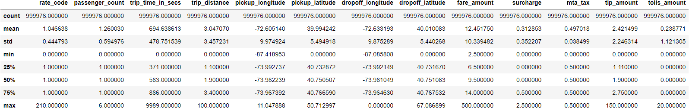

### Change Some dataset
```python
#let's change datatype
df['pickup_datetime'] = df['pickup_datetime'].astype('datetime64[ns]')
df['dropoff_datetime'] = df['dropoff_datetime'].astype('datetime64[ns]')
df['store_and_fwd_flag'] = df['store_and_fwd_flag'].astype('category')
```
```python
df.dtypes
```
    medallion                     object
    hack_license                  object
    vendor_id                     object
    rate_code                      int64
    store_and_fwd_flag          category
    pickup_datetime       datetime64[ns]
    dropoff_datetime      datetime64[ns]
    passenger_count                int64
    trip_time_in_secs              int64
    trip_distance                float64
    pickup_longitude             float64
    pickup_latitude              float64
    dropoff_longitude            float64
    dropoff_latitude             float64
    payment_type                  object
    fare_amount                  float64
    surcharge                    float64
    mta_tax                      float64
    tip_amount                   float64
    tolls_amount                 float64
    dtype: object

### Exploratory Data Analysis
```python
#visualise taxi rides
import seaborn as sns
def showrides(df, numlines):
  lats = []
  lons = []
  goodrows = df[df['pickup_longitude'] < -70]
  for iter, row in goodrows[:numlines].iterrows():
    lons.append(row['pickup_longitude'])
    lons.append(row['dropoff_longitude'])
    lons.append(None)
    lats.append(row['pickup_latitude'])
    lats.append(row['dropoff_latitude'])
    lats.append(None)

  plt.plot(lons, lats)

showrides(df, 10)
##Some taxi trips are small and some are long 
```    
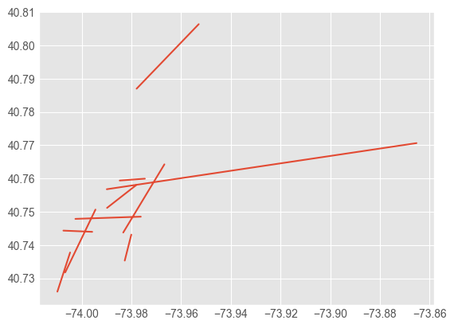


# Simple Rate calculation Using Test and Train Method.
```python
#Simple Rate calculation
#!pip install -U scikit-learn scipy matplotlib
from sklearn.model_selection import train_test_split

train, test = train_test_split(df, test_size=0.3, random_state=42)
```
```python
import numpy as np
import shutil

def distance_between(lat1, lon1, lat2, lon2):
     # Haversine formula to compute distance 
  dist = np.degrees(np.arccos(np.sin(np.radians(lat1)) * np.sin(np.radians(lat2)) + np.cos(np.radians(lat1)) * np.cos(np.radians(lat2)) * np.cos(np.radians(lon2 - lon1)))) * 60 * 1.515 * 1.609344
  return dist

def estimate_distance(df):
  return distance_between(df['pickup_latitude'], df['pickup_longitude'], df['dropoff_latitude'], df['dropoff_longitude'])

def compute_rmse(actual, predicted):
  return np.sqrt(np.mean((actual - predicted)**2))

def print_rmse(df, rate, name):
  print("{1} RMSE = {0}".format(compute_rmse(df['fare_amount'], rate * estimate_distance(df)), name))
```


```python
rate = train['fare_amount'].mean() / estimate_distance(train).mean()

print("Rate = ${0}/km".format(rate))
print_rmse(train, rate, 'Train')
print_rmse(test, rate, 'Test')
```
    Rate = $0.8242719085266287/km
    Train RMSE = 283.8357803562665
    Test RMSE = 276.9979411318129
    
### This clear shows us RootMeanSquareDeviation(RMSE) for test set is $276.997. 

# Univariate Analysis:

## Let us Explore the Date time and expand into weekday, month ,hour, minute to get a bigger picture while doing Analysis in our Data
- Let us create some new features from the existing variables so that we can gain more insights from the data.
- Remember pickup_datetime and dropoff_datetime were both of type object.
- If we want to make use of this data, we can convert it to datetime object which contains numerous functions with which we can create new features that we will see soon.

* We can convert it to datetime using the following code.
```python
df['pickup_datetime'] = pd.to_datetime(df['pickup_datetime'])
df['dropoff_datetime'] = pd.to_datetime(df['dropoff_datetime'])
```
* Now if you will run the dtypes function again, you will be able to see the type as datetime64[ns].

* Now, let us extract and create new features from this datetime features we just created.
```python
#extracting day of week (mon-sun)
df['pickup_day'] = df['pickup_datetime'].dt.day_name()
df['dropoff_day'] = df['dropoff_datetime'].dt.day_name()
#extracting day of the weekday
df['pickup_day_no'] = df['pickup_datetime'].dt.weekday
df['dropoff_day_no'] = df['dropoff_datetime'].dt.weekday
#Extracting month of the month
df['p_month'] = df['pickup_datetime'].dt.month_name()
df['d_month'] = df['dropoff_datetime'].dt.month_name()
# Creating features based on Hour
df['pickup_by_hour'] = df['pickup_datetime'].dt.hour
df['dropoff_by_hour'] = df['dropoff_datetime'].dt.hour
```
```python
df['pickup_day'].value_counts()
```

    Saturday     196652
    Sunday       180207
    Friday       175043
    Tuesday      150543
    Monday       105450
    Thursday     103634
    Wednesday     88447
    Name: pickup_day, dtype: int64

```python
df['dropoff_day'].value_counts()
```
    Saturday     196309
    Sunday       181866
    Friday       173357
    Tuesday      150874
    Monday       105851
    Thursday     103339
    Wednesday     88380
    Name: dropoff_day, dtype: int64


### We have created the following features:

- pickup_day and dropoff_day which will contain the name of the day on which the ride was taken.
- pickup_day_no and dropoff_day_no which will contain the day number instead of characters with Monday=0 and Sunday=6.
- pickup_hour and dropoff_hour with an hour of the day in the 24-hour format.
- pickup_month and dropoff_month with month number with January=1 and December=12.
- Next, I have defined a function that lets us determine what time of the day the ride was taken. I have created 4 time zones ‘Morning’ (from 6:00 am to 11:59 pm), ‘Afternoon’ (from 12 noon to 3:59 pm), ‘Evening’ (from 4:00 pm to 9:59 pm), and ‘Late Night’ (from 10:00 pm to 5:59 am)
```python
def part_of_day (t):
    if t in range (6,12):
        return "Morning"
    elif t in range (12,16):
        return "Afternoon"
    elif t in range (16,22):
        return "Evening"
    else:
        return "Night"
```
* let us apply this function and create new columns in the dataset.
```python
df['pickup_partofday'] = df['pickup_by_hour'].apply(part_of_day)
df['dropoff_partofday'] = df['dropoff_by_hour'].apply(part_of_day)
```
Check Pickup_partofday count
```python
df['pickup_partofday'].value_counts()
```

    Evening      334127
    Night        255746
    Morning      228027
    Afternoon    182076
    Name: pickup_partofday, dtype: int64
 ```python
df.head()
```
<div>
<style scoped>
    .dataframe tbody tr th:only-of-type {
        vertical-align: middle;
    }

    .dataframe tbody tr th {
        vertical-align: top;
    }

    .dataframe thead th {
        text-align: right;
    }
</style>
<table border="1" class="dataframe">
  <thead>
    <tr style="text-align: right;">
      <th></th>
      <th>medallion</th>
      <th>hack_license</th>
      <th>vendor_id</th>
      <th>rate_code</th>
      <th>store_and_fwd_flag</th>
      <th>pickup_datetime</th>
      <th>dropoff_datetime</th>
      <th>passenger_count</th>
      <th>trip_time_in_secs</th>
      <th>trip_distance</th>
      <th>...</th>
      <th>pickup_day</th>
      <th>dropoff_day</th>
      <th>pickup_day_no</th>
      <th>dropoff_day_no</th>
      <th>p_month</th>
      <th>d_month</th>
      <th>pickup_by_hour</th>
      <th>dropoff_by_hour</th>
      <th>pickup_partofday</th>
      <th>dropoff_partofday</th>
    </tr>
  </thead>
  <tbody>
    <tr>
      <th>0</th>
      <td>89D227B655E5C82AECF13C3F540D4CF4</td>
      <td>BA96DE419E711691B9445D6A6307C170</td>
      <td>CMT</td>
      <td>1</td>
      <td>0</td>
      <td>2013-01-01 15:11:48</td>
      <td>2013-01-01 15:18:10</td>
      <td>4</td>
      <td>382</td>
      <td>1.0</td>
      <td>...</td>
      <td>Tuesday</td>
      <td>Tuesday</td>
      <td>1</td>
      <td>1</td>
      <td>January</td>
      <td>January</td>
      <td>15</td>
      <td>15</td>
      <td>Afternoon</td>
      <td>Afternoon</td>
    </tr>
    <tr>
      <th>1</th>
      <td>0BD7C8F5BA12B88E0B67BED28BEA73D8</td>
      <td>9FD8F69F0804BDB5549F40E9DA1BE472</td>
      <td>CMT</td>
      <td>1</td>
      <td>0</td>
      <td>2013-01-06 00:18:35</td>
      <td>2013-01-06 00:22:54</td>
      <td>1</td>
      <td>259</td>
      <td>1.5</td>
      <td>...</td>
      <td>Sunday</td>
      <td>Sunday</td>
      <td>6</td>
      <td>6</td>
      <td>January</td>
      <td>January</td>
      <td>0</td>
      <td>0</td>
      <td>Night</td>
      <td>Night</td>
    </tr>
    <tr>
      <th>2</th>
      <td>0BD7C8F5BA12B88E0B67BED28BEA73D8</td>
      <td>9FD8F69F0804BDB5549F40E9DA1BE472</td>
      <td>CMT</td>
      <td>1</td>
      <td>0</td>
      <td>2013-01-05 18:49:41</td>
      <td>2013-01-05 18:54:23</td>
      <td>1</td>
      <td>282</td>
      <td>1.1</td>
      <td>...</td>
      <td>Saturday</td>
      <td>Saturday</td>
      <td>5</td>
      <td>5</td>
      <td>January</td>
      <td>January</td>
      <td>18</td>
      <td>18</td>
      <td>Evening</td>
      <td>Evening</td>
    </tr>
    <tr>
      <th>3</th>
      <td>DFD2202EE08F7A8DC9A57B02ACB81FE2</td>
      <td>51EE87E3205C985EF8431D850C786310</td>
      <td>CMT</td>
      <td>1</td>
      <td>0</td>
      <td>2013-01-07 23:54:15</td>
      <td>2013-01-07 23:58:20</td>
      <td>2</td>
      <td>244</td>
      <td>0.7</td>
      <td>...</td>
      <td>Monday</td>
      <td>Monday</td>
      <td>0</td>
      <td>0</td>
      <td>January</td>
      <td>January</td>
      <td>23</td>
      <td>23</td>
      <td>Night</td>
      <td>Night</td>
    </tr>
    <tr>
      <th>4</th>
      <td>DFD2202EE08F7A8DC9A57B02ACB81FE2</td>
      <td>51EE87E3205C985EF8431D850C786310</td>
      <td>CMT</td>
      <td>1</td>
      <td>0</td>
      <td>2013-01-07 23:25:03</td>
      <td>2013-01-07 23:34:24</td>
      <td>1</td>
      <td>560</td>
      <td>2.1</td>
      <td>...</td>
      <td>Monday</td>
      <td>Monday</td>
      <td>0</td>
      <td>0</td>
      <td>January</td>
      <td>January</td>
      <td>23</td>
      <td>23</td>
      <td>Night</td>
      <td>Night</td>
    </tr>
  </tbody>
</table>
<p>5 rows × 30 columns</p>
</div>

```python
df['pickup_partofday'].value_counts(normalize = True).plot(kind = 'bar')
```

    <AxesSubplot: >
   
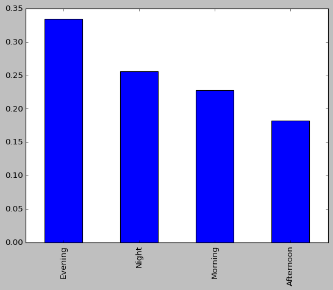

-  Evening time is the most busiest Time followed by Night and then Morning which makes sense as most people leave from office in evening and and few in Night and people have to reach office in morning and very less people travel in afternoon that's in afternoon it's less busy.

### Trips Per day
```python
figure,(ax1,ax2)=plt.subplots(ncols=2,figsize=(20,5))
ax1.set_title('Pickup Days')
ax=sns.countplot(x="pickup_day",data=df,ax=ax1)
ax2.set_title('Dropoff Days')
ax=sns.countplot(x="dropoff_day",data=df,ax=ax2)
```
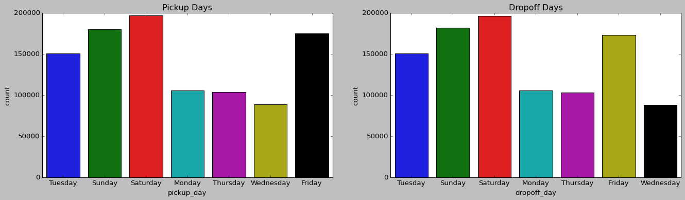
```python
# Creating two new features called pickup_part_of_day and dropoff_part_of_day.

df['pickup_part_of_day']=df['pickup_by_hour'].apply(part_of_day)
df['dropoff_part_of_day']=df['dropoff_by_hour'].apply(part_of_day)
```
```python
# Check to see if the formula has been applied correctly 

df[['pickup_part_of_day','dropoff_part_of_day']].head()
df
```
<div>
<style scoped>
    .dataframe tbody tr th:only-of-type {
        vertical-align: middle;
    }

    .dataframe tbody tr th {
        vertical-align: top;
    }

    .dataframe thead th {
        text-align: right;
    }
</style>
<table border="1" class="dataframe">
  <thead>
    <tr style="text-align: right;">
      <th></th>
      <th>medallion</th>
      <th>hack_license</th>
      <th>vendor_id</th>
      <th>rate_code</th>
      <th>store_and_fwd_flag</th>
      <th>pickup_datetime</th>
      <th>dropoff_datetime</th>
      <th>passenger_count</th>
      <th>trip_time_in_secs</th>
      <th>trip_distance</th>
      <th>...</th>
      <th>pickup_day_no</th>
      <th>dropoff_day_no</th>
      <th>p_month</th>
      <th>d_month</th>
      <th>pickup_by_hour</th>
      <th>dropoff_by_hour</th>
      <th>pickup_partofday</th>
      <th>dropoff_partofday</th>
      <th>pickup_part_of_day</th>
      <th>dropoff_part_of_day</th>
    </tr>
  </thead>
  <tbody>
    <tr>
      <th>0</th>
      <td>89D227B655E5C82AECF13C3F540D4CF4</td>
      <td>BA96DE419E711691B9445D6A6307C170</td>
      <td>CMT</td>
      <td>1</td>
      <td>0</td>
      <td>2013-01-01 15:11:48</td>
      <td>2013-01-01 15:18:10</td>
      <td>4</td>
      <td>382</td>
      <td>1.0</td>
      <td>...</td>
      <td>1</td>
      <td>1</td>
      <td>January</td>
      <td>January</td>
      <td>15</td>
      <td>15</td>
      <td>Afternoon</td>
      <td>Afternoon</td>
      <td>Afternoon</td>
      <td>Afternoon</td>
    </tr>
    <tr>
      <th>1</th>
      <td>0BD7C8F5BA12B88E0B67BED28BEA73D8</td>
      <td>9FD8F69F0804BDB5549F40E9DA1BE472</td>
      <td>CMT</td>
      <td>1</td>
      <td>0</td>
      <td>2013-01-06 00:18:35</td>
      <td>2013-01-06 00:22:54</td>
      <td>1</td>
      <td>259</td>
      <td>1.5</td>
      <td>...</td>
      <td>6</td>
      <td>6</td>
      <td>January</td>
      <td>January</td>
      <td>0</td>
      <td>0</td>
      <td>Night</td>
      <td>Night</td>
      <td>Night</td>
      <td>Night</td>
    </tr>
    <tr>
      <th>2</th>
      <td>0BD7C8F5BA12B88E0B67BED28BEA73D8</td>
      <td>9FD8F69F0804BDB5549F40E9DA1BE472</td>
      <td>CMT</td>
      <td>1</td>
      <td>0</td>
      <td>2013-01-05 18:49:41</td>
      <td>2013-01-05 18:54:23</td>
      <td>1</td>
      <td>282</td>
      <td>1.1</td>
      <td>...</td>
      <td>5</td>
      <td>5</td>
      <td>January</td>
      <td>January</td>
      <td>18</td>
      <td>18</td>
      <td>Evening</td>
      <td>Evening</td>
      <td>Evening</td>
      <td>Evening</td>
    </tr>
    <tr>
      <th>3</th>
      <td>DFD2202EE08F7A8DC9A57B02ACB81FE2</td>
      <td>51EE87E3205C985EF8431D850C786310</td>
      <td>CMT</td>
      <td>1</td>
      <td>0</td>
      <td>2013-01-07 23:54:15</td>
      <td>2013-01-07 23:58:20</td>
      <td>2</td>
      <td>244</td>
      <td>0.7</td>
      <td>...</td>
      <td>0</td>
      <td>0</td>
      <td>January</td>
      <td>January</td>
      <td>23</td>
      <td>23</td>
      <td>Night</td>
      <td>Night</td>
      <td>Night</td>
      <td>Night</td>
    </tr>
    <tr>
      <th>4</th>
      <td>DFD2202EE08F7A8DC9A57B02ACB81FE2</td>
      <td>51EE87E3205C985EF8431D850C786310</td>
      <td>CMT</td>
      <td>1</td>
      <td>0</td>
      <td>2013-01-07 23:25:03</td>
      <td>2013-01-07 23:34:24</td>
      <td>1</td>
      <td>560</td>
      <td>2.1</td>
      <td>...</td>
      <td>0</td>
      <td>0</td>
      <td>January</td>
      <td>January</td>
      <td>23</td>
      <td>23</td>
      <td>Night</td>
      <td>Night</td>
      <td>Night</td>
      <td>Night</td>
    </tr>
    <tr>
      <th>...</th>
      <td>...</td>
      <td>...</td>
      <td>...</td>
      <td>...</td>
      <td>...</td>
      <td>...</td>
      <td>...</td>
      <td>...</td>
      <td>...</td>
      <td>...</td>
      <td>...</td>
      <td>...</td>
      <td>...</td>
      <td>...</td>
      <td>...</td>
      <td>...</td>
      <td>...</td>
      <td>...</td>
      <td>...</td>
      <td>...</td>
      <td>...</td>
    </tr>
    <tr>
      <th>999971</th>
      <td>B8F7DF6571061CB9FE56FCB47CCBFB56</td>
      <td>D59F36B8E5D07E7E8334502BB2335212</td>
      <td>CMT</td>
      <td>1</td>
      <td>0</td>
      <td>2013-01-08 17:08:54</td>
      <td>2013-01-08 17:23:07</td>
      <td>1</td>
      <td>853</td>
      <td>2.9</td>
      <td>...</td>
      <td>1</td>
      <td>1</td>
      <td>January</td>
      <td>January</td>
      <td>17</td>
      <td>17</td>
      <td>Evening</td>
      <td>Evening</td>
      <td>Evening</td>
      <td>Evening</td>
    </tr>
    <tr>
      <th>999972</th>
      <td>6F506ED1BE0832385B9810F08B1E6466</td>
      <td>D5C15D63D909DF7A66453C2E9AE29930</td>
      <td>CMT</td>
      <td>1</td>
      <td>0</td>
      <td>2013-01-08 18:31:11</td>
      <td>2013-01-08 18:43:20</td>
      <td>1</td>
      <td>729</td>
      <td>2.1</td>
      <td>...</td>
      <td>1</td>
      <td>1</td>
      <td>January</td>
      <td>January</td>
      <td>18</td>
      <td>18</td>
      <td>Evening</td>
      <td>Evening</td>
      <td>Evening</td>
      <td>Evening</td>
    </tr>
    <tr>
      <th>999973</th>
      <td>9D00885D2304874EFB6F7A2070986452</td>
      <td>FC8C39EC2AFF41C066D3EE63DC9C61E2</td>
      <td>CMT</td>
      <td>1</td>
      <td>0</td>
      <td>2013-01-08 20:18:45</td>
      <td>2013-01-08 20:44:44</td>
      <td>1</td>
      <td>1559</td>
      <td>4.7</td>
      <td>...</td>
      <td>1</td>
      <td>1</td>
      <td>January</td>
      <td>January</td>
      <td>20</td>
      <td>20</td>
      <td>Evening</td>
      <td>Evening</td>
      <td>Evening</td>
      <td>Evening</td>
    </tr>
    <tr>
      <th>999974</th>
      <td>BBEFF42C6DF9D215155BBBFF7A0D77FA</td>
      <td>FEDAD918D5A1CFAFEBCBD63F6AE282D3</td>
      <td>CMT</td>
      <td>1</td>
      <td>0</td>
      <td>2013-01-08 18:21:54</td>
      <td>2013-01-08 18:54:38</td>
      <td>1</td>
      <td>1964</td>
      <td>1.2</td>
      <td>...</td>
      <td>1</td>
      <td>1</td>
      <td>January</td>
      <td>January</td>
      <td>18</td>
      <td>18</td>
      <td>Evening</td>
      <td>Evening</td>
      <td>Evening</td>
      <td>Evening</td>
    </tr>
    <tr>
      <th>999975</th>
      <td>136AE90171857FD5C3CFCB0C90013013</td>
      <td>92D9018C2071AAFD977EA3155BB782E6</td>
      <td>CMT</td>
      <td>1</td>
      <td>0</td>
      <td>2013-01-08 15:05:41</td>
      <td>2013-01-08 15:16:43</td>
      <td>1</td>
      <td>661</td>
      <td>1.2</td>
      <td>...</td>
      <td>1</td>
      <td>1</td>
      <td>January</td>
      <td>January</td>
      <td>15</td>
      <td>15</td>
      <td>Afternoon</td>
      <td>Afternoon</td>
      <td>Afternoon</td>
      <td>Afternoon</td>
    </tr>
  </tbody>
</table>
<p>999976 rows × 32 columns</p>
</div>

```python
plt.style.use("dark_background")
figure,ax=plt.subplots(nrows=1,ncols=2,figsize=(15,5))
sns.countplot(x='pickup_by_hour',data=df,ax=ax[0])
ax[0].set_title('The distribution of number of pickups on each hour of the day')
sns.countplot(x='dropoff_by_hour',data=df,ax=ax[1])
ax[1].set_title('The distribution of number of dropoffs on each hour of the day')
plt.tight_layout()
     
```
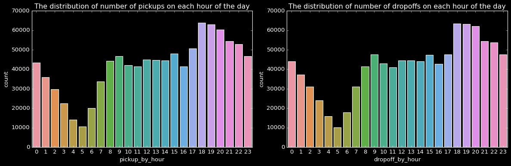

```python
plt.style.use("dark_background")
plt.figure(figsize=(20,10))
sns.heatmap(df.corr()*100, annot=True, cmap='inferno')
plt.title('Correlation Plot')
```
    Text(0.5, 1.0, 'Correlation Plot')
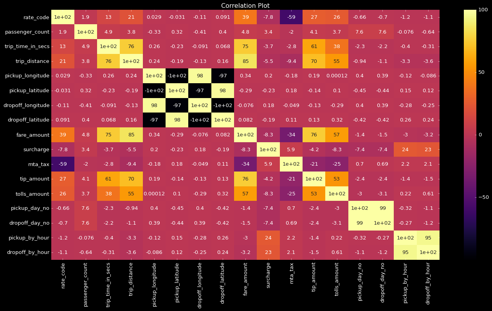

# Bivariate Analysis: 
```python
plt.figure(figsize = (14, 4))
n, bins, patches = plt.hist(df.fare_amount, 1000, facecolor='red', alpha=0.75)
plt.xlabel('Fare amount')
plt.title('Histogram of fare amount')
plt.xlim(0, 200)
plt.show();
```
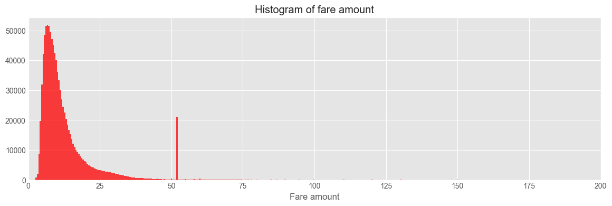
```python
df.groupby('fare_amount').size().nlargest(10)
```

    fare_amount
    6.5    51810
    6.0    51483
    7.0    51469
    7.5    49551
    5.5    48510
    8.0    47035
    8.5    45180
    9.0    42581
    5.0    42125
    9.5    40097
    dtype: int64
```python
plt.style.use("dark_background")
sns.distplot(df['passenger_count'],kde=False)
plt.title('Distribution of Passenger Count')
plt.show()
```
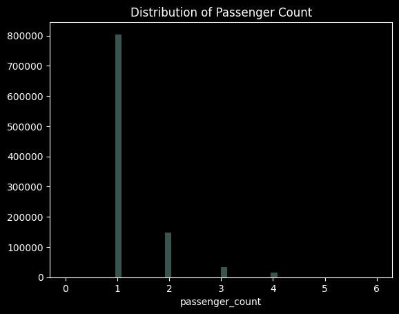
```python
df.groupby('passenger_count').size()
```

    passenger_count
    0         3
    1    804445
    2    146831
    3     33354
    4     14910
    5       407
    6        26
    dtype: int64
```python
sns.barplot(x = 'passenger_count',y ='trip_distance',data=df)
```
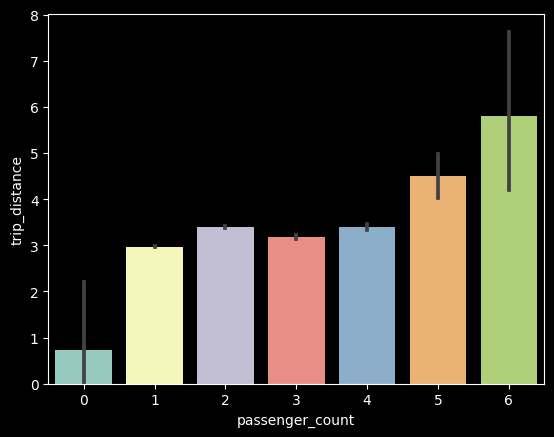
Lets see relationship b/w store and _fwd flag and Trip Duration that we discussed earlier to see in Bivariate Analysis:
```python
plt.style.use("classic")
plt.figure(figsize=(8,8))
plt.pie(x, colors=['lightgreen', 'lightcoral'], shadow=True, explode=[0.5,0], autopct='%1.2f%%', startangle=200)
plt.legend(labels=['Y','N'])
plt.title("Store and Forward Flag")
```
    Text(0.5, 1.0, 'Store and Forward Flag')    
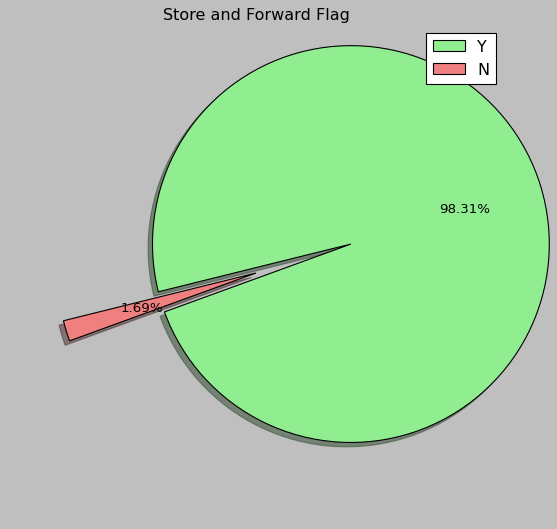
```python
df['store_and_fwd_flag']=df['store_and_fwd_flag'].apply(lambda x : 0 if x=='N' else 1)
```
```python
x=df['store_and_fwd_flag'].value_counts()
x
```

    N    983110
    Y     16866
    Name: store_and_fwd_flag, dtype: int64
- The Trip is Not Recorded for Longer Trip we can observe from there.For Short Trip it isrecorded

### Calculate the distance from Longitude and latitudes.
```python
#a function is created to calculate the distance from latitudes and longitudes
from math import radians, cos, sin, asin, sqrt
def haversine(df):
    lat1, lon1, lat2, lon2 = df.pickup_latitude,df.pickup_longitude,df.dropoff_latitude,df.dropoff_longitude 
    R = 3959.87433 # this is in miles.  For Earth radius in kilometers use 6372.8 km
    dLat = radians(lat2 - lat1)
    dLon = radians(lon2 - lon1)
    lat1 = radians(lat1)
    lat2 = radians(lat2)
    a = sin(dLat/2)**2 + cos(lat1)*cos(lat2)*sin(dLon/2)**2
    c = 2*asin(sqrt(a))
    return R * c
```
```python
df['distance'] = df.apply(lambda x: haversine(x), axis = 1)
```
```python
sns.scatterplot(x='distance',y='trip_distance',data=df,color = 'black')
```
    <AxesSubplot: xlabel='distance', ylabel='trip_distance'>   
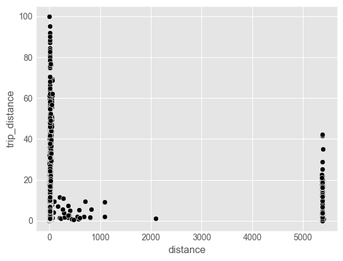
```python
print('The no of rows with distance =0 are {}'.format(len(df[df.distance==0])))
```

    The no of rows with distance =0 are 0
    

- That’s quite a number! We will not drop these rows. Rather we will replace these datas with the average distance


```python
mean_dist=df['distance'].mean()
df.loc[df['distance']==0,'distance']=mean_dist
```
### Importing the library which lets us calculate distance from geographical coordinates.

```python
#!pip install geopy
from geopy.distance import great_circle
```
- Defining a function to take coordinates as inputs and return us distance.

```python
def distance_trip(pickup_longitude,pickup_latitude,dropoff_longitude,dropoff_latitude):
    start_coordinates = (pickup_longitude,pickup_latitude)
    stop_coordinates = (dropoff_longitude,dropoff_latitude)
    return great_circle(start_coordinates,stop_coordinates).km
```
- Finally, applying the function to our dataset and creating the feature ‘distance’.

```python
df['distance'] = df.apply(lambda x: distance_trip(x['pickup_latitude'],x['pickup_longitude'],x['dropoff_latitude'],x['dropoff_longitude']), axis=1)
```

### Let us Now see the Correlation b/w different variables in our Dataset

```python
numerical = df.select_dtypes(include =['int64','float64','Int64'])[:]
numerical.dtypes
```
    rate_code              int64
    passenger_count        int64
    trip_time_in_secs      int64
    trip_distance        float64
    pickup_longitude     float64
    pickup_latitude      float64
    dropoff_longitude    float64
    dropoff_latitude     float64
    fare_amount          float64
    surcharge            float64
    mta_tax              float64
    tip_amount           float64
    tolls_amount         float64
    distance             float64
    dtype: object
- Numerical Data Types in our dataset
```python
correlation = numerical.dropna().corr()
correlation
```


<div>
<style scoped>
    .dataframe tbody tr th:only-of-type {
        vertical-align: middle;
    }

    .dataframe tbody tr th {
        vertical-align: top;
    }

    .dataframe thead th {
        text-align: right;
    }
</style>
<table border="1" class="dataframe">
  <thead>
    <tr style="text-align: right;">
      <th></th>
      <th>rate_code</th>
      <th>passenger_count</th>
      <th>trip_time_in_secs</th>
      <th>trip_distance</th>
      <th>pickup_longitude</th>
      <th>pickup_latitude</th>
      <th>dropoff_longitude</th>
      <th>dropoff_latitude</th>
      <th>fare_amount</th>
      <th>surcharge</th>
      <th>mta_tax</th>
      <th>tip_amount</th>
      <th>tolls_amount</th>
      <th>distance</th>
    </tr>
  </thead>
  <tbody>
    <tr>
      <th>rate_code</th>
      <td>1.000000</td>
      <td>0.019143</td>
      <td>0.128962</td>
      <td>0.210538</td>
      <td>0.000289</td>
      <td>-0.000307</td>
      <td>-0.001098</td>
      <td>0.000910</td>
      <td>0.392990</td>
      <td>-0.077875</td>
      <td>-0.594938</td>
      <td>0.265954</td>
      <td>0.255200</td>
      <td>0.010491</td>
    </tr>
    <tr>
      <th>passenger_count</th>
      <td>0.019143</td>
      <td>1.000000</td>
      <td>0.049497</td>
      <td>0.038089</td>
      <td>-0.003326</td>
      <td>0.003170</td>
      <td>-0.004109</td>
      <td>0.003996</td>
      <td>0.047881</td>
      <td>0.033702</td>
      <td>-0.019716</td>
      <td>0.040750</td>
      <td>0.037168</td>
      <td>0.005207</td>
    </tr>
    <tr>
      <th>trip_time_in_secs</th>
      <td>0.128962</td>
      <td>0.049497</td>
      <td>1.000000</td>
      <td>0.761696</td>
      <td>0.002570</td>
      <td>-0.002265</td>
      <td>-0.000914</td>
      <td>0.000683</td>
      <td>0.754007</td>
      <td>-0.037467</td>
      <td>-0.027940</td>
      <td>0.609114</td>
      <td>0.382354</td>
      <td>0.030712</td>
    </tr>
    <tr>
      <th>trip_distance</th>
      <td>0.210538</td>
      <td>0.038089</td>
      <td>0.761696</td>
      <td>1.000000</td>
      <td>0.002447</td>
      <td>-0.001873</td>
      <td>-0.001296</td>
      <td>0.001604</td>
      <td>0.853624</td>
      <td>-0.055374</td>
      <td>-0.093674</td>
      <td>0.702393</td>
      <td>0.553500</td>
      <td>0.030593</td>
    </tr>
    <tr>
      <th>pickup_longitude</th>
      <td>0.000289</td>
      <td>-0.003326</td>
      <td>0.002570</td>
      <td>0.002447</td>
      <td>1.000000</td>
      <td>-0.999908</td>
      <td>0.975004</td>
      <td>-0.974926</td>
      <td>0.003365</td>
      <td>0.001967</td>
      <td>-0.001777</td>
      <td>0.001903</td>
      <td>0.000001</td>
      <td>0.157417</td>
    </tr>
    <tr>
      <th>pickup_latitude</th>
      <td>-0.000307</td>
      <td>0.003170</td>
      <td>-0.002265</td>
      <td>-0.001873</td>
      <td>-0.999908</td>
      <td>1.000000</td>
      <td>-0.974961</td>
      <td>0.975001</td>
      <td>-0.002887</td>
      <td>-0.002348</td>
      <td>0.001842</td>
      <td>-0.001429</td>
      <td>0.000996</td>
      <td>-0.157337</td>
    </tr>
    <tr>
      <th>dropoff_longitude</th>
      <td>-0.001098</td>
      <td>-0.004109</td>
      <td>-0.000914</td>
      <td>-0.001296</td>
      <td>0.975004</td>
      <td>-0.974961</td>
      <td>1.000000</td>
      <td>-0.999888</td>
      <td>-0.000758</td>
      <td>0.001759</td>
      <td>-0.000494</td>
      <td>-0.001273</td>
      <td>-0.002860</td>
      <td>0.065488</td>
    </tr>
    <tr>
      <th>dropoff_latitude</th>
      <td>0.000910</td>
      <td>0.003996</td>
      <td>0.000683</td>
      <td>0.001604</td>
      <td>-0.974926</td>
      <td>0.975001</td>
      <td>-0.999888</td>
      <td>1.000000</td>
      <td>0.000824</td>
      <td>-0.001909</td>
      <td>0.001146</td>
      <td>0.001315</td>
      <td>0.003240</td>
      <td>-0.065387</td>
    </tr>
    <tr>
      <th>fare_amount</th>
      <td>0.392990</td>
      <td>0.047881</td>
      <td>0.754007</td>
      <td>0.853624</td>
      <td>0.003365</td>
      <td>-0.002887</td>
      <td>-0.000758</td>
      <td>0.000824</td>
      <td>1.000000</td>
      <td>-0.083478</td>
      <td>-0.343940</td>
      <td>0.763768</td>
      <td>0.568020</td>
      <td>0.031147</td>
    </tr>
    <tr>
      <th>surcharge</th>
      <td>-0.077875</td>
      <td>0.033702</td>
      <td>-0.037467</td>
      <td>-0.055374</td>
      <td>0.001967</td>
      <td>-0.002348</td>
      <td>0.001759</td>
      <td>-0.001909</td>
      <td>-0.083478</td>
      <td>1.000000</td>
      <td>0.059438</td>
      <td>-0.042008</td>
      <td>-0.083156</td>
      <td>-0.003946</td>
    </tr>
    <tr>
      <th>mta_tax</th>
      <td>-0.594938</td>
      <td>-0.019716</td>
      <td>-0.027940</td>
      <td>-0.093674</td>
      <td>-0.001777</td>
      <td>0.001842</td>
      <td>-0.000494</td>
      <td>0.001146</td>
      <td>-0.343940</td>
      <td>0.059438</td>
      <td>1.000000</td>
      <td>-0.206133</td>
      <td>-0.245644</td>
      <td>-0.005065</td>
    </tr>
    <tr>
      <th>tip_amount</th>
      <td>0.265954</td>
      <td>0.040750</td>
      <td>0.609114</td>
      <td>0.702393</td>
      <td>0.001903</td>
      <td>-0.001429</td>
      <td>-0.001273</td>
      <td>0.001315</td>
      <td>0.763768</td>
      <td>-0.042008</td>
      <td>-0.206133</td>
      <td>1.000000</td>
      <td>0.526738</td>
      <td>0.024257</td>
    </tr>
    <tr>
      <th>tolls_amount</th>
      <td>0.255200</td>
      <td>0.037168</td>
      <td>0.382354</td>
      <td>0.553500</td>
      <td>0.000001</td>
      <td>0.000996</td>
      <td>-0.002860</td>
      <td>0.003240</td>
      <td>0.568020</td>
      <td>-0.083156</td>
      <td>-0.245644</td>
      <td>0.526738</td>
      <td>1.000000</td>
      <td>0.024993</td>
    </tr>
    <tr>
      <th>distance</th>
      <td>0.010491</td>
      <td>0.005207</td>
      <td>0.030712</td>
      <td>0.030593</td>
      <td>0.157417</td>
      <td>-0.157337</td>
      <td>0.065488</td>
      <td>-0.065387</td>
      <td>0.031147</td>
      <td>-0.003946</td>
      <td>-0.005065</td>
      <td>0.024257</td>
      <td>0.024993</td>
      <td>1.000000</td>
    </tr>
  </tbody>
</table>
</div>

- This is a very huge table we got from correlation() Function. Let us see the Pearson Coefficent in smaller table which can be easy to refer
Let us unstack all the Numerical columns and then do a quick sort followed by creating a date frame having our sorted values and coefficient together to Analyze:
```python
c = numerical.corr().abs()
s = c.unstack()
so = s.sort_values(kind = 'quicksort', ascending = False)
so = pd.DataFrame(so,columns=['Pearson Coeficient'])
```


```python
so[so['Pearson Coeficient']<1].head(25)
```


<div>
<style scoped>
    .dataframe tbody tr th:only-of-type {
        vertical-align: middle;
    }

    .dataframe tbody tr th {
        vertical-align: top;
    }

    .dataframe thead th {
        text-align: right;
    }
</style>
<table border="1" class="dataframe">
  <thead>
    <tr style="text-align: right;">
      <th></th>
      <th></th>
      <th>Pearson Coeficient</th>
    </tr>
  </thead>
  <tbody>
    <tr>
      <th>pickup_longitude</th>
      <th>pickup_latitude</th>
      <td>0.999908</td>
    </tr>
    <tr>
      <th>pickup_latitude</th>
      <th>pickup_longitude</th>
      <td>0.999908</td>
    </tr>
    <tr>
      <th>dropoff_longitude</th>
      <th>dropoff_latitude</th>
      <td>0.999888</td>
    </tr>
    <tr>
      <th>dropoff_latitude</th>
      <th>dropoff_longitude</th>
      <td>0.999888</td>
    </tr>
    <tr>
      <th>dropoff_longitude</th>
      <th>pickup_longitude</th>
      <td>0.975004</td>
    </tr>
    <tr>
      <th>pickup_longitude</th>
      <th>dropoff_longitude</th>
      <td>0.975004</td>
    </tr>
    <tr>
      <th>dropoff_latitude</th>
      <th>pickup_latitude</th>
      <td>0.975001</td>
    </tr>
    <tr>
      <th rowspan="2" valign="top">pickup_latitude</th>
      <th>dropoff_latitude</th>
      <td>0.975001</td>
    </tr>
    <tr>
      <th>dropoff_longitude</th>
      <td>0.974961</td>
    </tr>
    <tr>
      <th>dropoff_longitude</th>
      <th>pickup_latitude</th>
      <td>0.974961</td>
    </tr>
    <tr>
      <th>dropoff_latitude</th>
      <th>pickup_longitude</th>
      <td>0.974926</td>
    </tr>
    <tr>
      <th>pickup_longitude</th>
      <th>dropoff_latitude</th>
      <td>0.974926</td>
    </tr>
    <tr>
      <th>fare_amount</th>
      <th>trip_distance</th>
      <td>0.853624</td>
    </tr>
    <tr>
      <th>trip_distance</th>
      <th>fare_amount</th>
      <td>0.853624</td>
    </tr>
    <tr>
      <th>fare_amount</th>
      <th>tip_amount</th>
      <td>0.763768</td>
    </tr>
    <tr>
      <th>tip_amount</th>
      <th>fare_amount</th>
      <td>0.763768</td>
    </tr>
    <tr>
      <th>trip_time_in_secs</th>
      <th>trip_distance</th>
      <td>0.761696</td>
    </tr>
    <tr>
      <th>trip_distance</th>
      <th>trip_time_in_secs</th>
      <td>0.761696</td>
    </tr>
    <tr>
      <th>trip_time_in_secs</th>
      <th>fare_amount</th>
      <td>0.754007</td>
    </tr>
    <tr>
      <th>fare_amount</th>
      <th>trip_time_in_secs</th>
      <td>0.754007</td>
    </tr>
    <tr>
      <th>tip_amount</th>
      <th>trip_distance</th>
      <td>0.702393</td>
    </tr>
    <tr>
      <th>trip_distance</th>
      <th>tip_amount</th>
      <td>0.702393</td>
    </tr>
    <tr>
      <th>trip_time_in_secs</th>
      <th>tip_amount</th>
      <td>0.609114</td>
    </tr>
    <tr>
      <th>tip_amount</th>
      <th>trip_time_in_secs</th>
      <td>0.609114</td>
    </tr>
    <tr>
      <th>rate_code</th>
      <th>mta_tax</th>
      <td>0.594938</td>
    </tr>
  </tbody>
</table>
</div>
- Pickup Latitude and Drop-off Latitude have the higest correlation as we can see.

## Let us Draw heatmap to see all the Correlations:

```python
plt.figure(figsize=(20,6),dpi=140)
for j, i in enumerate(['pearson','kendall','spearman']):
    plt.subplot(1,3,j+1)
    correlation = numerical.dropna().corr(method=i)
    sns.heatmap(correlation, linewidth = 2)
    plt.title(i, fontsize = 18)
```
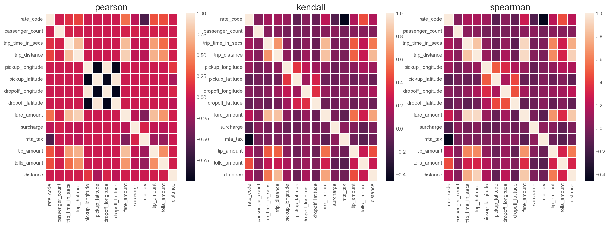
Kendall,& Spearman correlation seem to have very similar pattern between them, except the slight variation in magnitude of correlation.
* Too many variables with insignificant correlation.
* Major correlation lies between the drop off hour and pickup hour.

## the fare of a taxi trip given information about pickup and drop off locations, the pick up date time and the number of the passengers travelling in New York.

```python
df.loc[df['fare_amount']>200].shape
```
    (51, 32)

```python
#New york latitude , longitude range
boundary={'min_lng':-74.5,
              'min_lat':40.7,
              'max_lng':-72.8, 
              'max_lat':41.8}
```
```python
##  consider locations within New York City
for long_value in ['pickup_longitude', 'dropoff_longitude']:
  df = df[(df[long_value] > boundary['min_lng']) & (df[long_value] < boundary['max_lng'])]
for lat_value in ['pickup_latitude', 'dropoff_latitude']:
  df = df[(df[lat_value] > boundary['min_lat']) & (df[lat_value] <boundary['max_lat'])]
```

```python
# plot histogram of fare
df[df['fare_amount']>100].fare_amount.hist(bins=100, figsize=(14,3))
plt.xlabel('fare Amount $USD')
plt.title('Histogram');
```

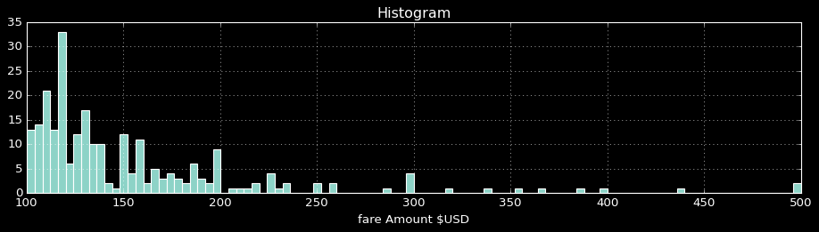

```python
def distance_trip(latitude1,longitude1,latitude2,longitude2):
  r = 6373 # earth's radius
  latitude1 = np.deg2rad(latitude1)
  longitude1 = np.deg2rad(longitude1)
  latitude2 = np.deg2rad(latitude2)
  longitude2= np.deg2rad(longitude2)
  dlat = latitude2 - latitude1
  dlon = longitude2 - longitude1
  a = np.sin(dlat/2)**2 + np.cos(latitude1) * np.cos(latitude2) * np.sin(dlon/2)**2
  c = 2 * np.arctan2(np.sqrt(a), np.sqrt(1-a))
  distance = r*c
  return distance
def direction_angle(latitude1,longitude1,latitude2,longitude2):
  dlon = longitude2 - longitude1
  x = np.cos(latitude2)* np.sin(dlon)
  y= np.cos(latitude1)* np.sin(latitude2) - np.sin(latitude1)*np.cos(latitude2) * np.cos(dlon)
  beta_en_radians = np.arctan2(x,y)
  beta_en_degres = np.rad2deg(beta_en_radians)
  return beta_en_degres
```
```python
#distance away from  three major airports, Central park and Manhattan

airports = {'JFK': (-73.78,40.643),'LGA': (-73.87, 40.77),'EWR' : (-74.18, 40.69),'MNT':(-73.97,40.7831),'Cenpark':(-73.96,40.77)}
for airport in airports:
  df['pickup_dist_' + airport] = distance_trip(df['pickup_latitude'], df['pickup_longitude'], airports[airport][1], airports[airport][0])
  df['dropoff_dist_' + airport] = distance_trip(df['dropoff_latitude'], df['dropoff_longitude'], airports[airport][1], airports[airport][0])
```
```python
#trip distance
df['trip_distance'] = distance_trip(df['pickup_latitude'], df['pickup_longitude'], df['dropoff_latitude'], df['dropoff_longitude'])
```
```python
#trip direction north south east west
df['direction'] = direction_angle(df['pickup_latitude'], df['pickup_longitude'], df['dropoff_latitude'], df['dropoff_longitude'])
```


```python
df.head()
```


<div>
<style scoped>
    .dataframe tbody tr th:only-of-type {
        vertical-align: middle;
    }

    .dataframe tbody tr th {
        vertical-align: top;
    }

    .dataframe thead th {
        text-align: right;
    }
</style>
<table border="1" class="dataframe">
  <thead>
    <tr style="text-align: right;">
      <th></th>
      <th>medallion</th>
      <th>hack_license</th>
      <th>vendor_id</th>
      <th>rate_code</th>
      <th>store_and_fwd_flag</th>
      <th>pickup_datetime</th>
      <th>dropoff_datetime</th>
      <th>passenger_count</th>
      <th>trip_time_in_secs</th>
      <th>trip_distance</th>
      <th>...</th>
      <th>dropoff_dist_JFK</th>
      <th>pickup_dist_LGA</th>
      <th>dropoff_dist_LGA</th>
      <th>pickup_dist_EWR</th>
      <th>dropoff_dist_EWR</th>
      <th>pickup_dist_MNT</th>
      <th>dropoff_dist_MNT</th>
      <th>pickup_dist_Cenpark</th>
      <th>dropoff_dist_Cenpark</th>
      <th>direction</th>
    </tr>
  </thead>
  <tbody>
    <tr>
      <th>0</th>
      <td>89D227B655E5C82AECF13C3F540D4CF4</td>
      <td>BA96DE419E711691B9445D6A6307C170</td>
      <td>CMT</td>
      <td>1</td>
      <td>0</td>
      <td>2013-01-01 15:11:48</td>
      <td>2013-01-01 15:18:10</td>
      <td>4</td>
      <td>382</td>
      <td>1.241150</td>
      <td>...</td>
      <td>21.398754</td>
      <td>9.210086</td>
      <td>10.311332</td>
      <td>18.618462</td>
      <td>17.415033</td>
      <td>2.877828</td>
      <td>3.925015</td>
      <td>2.032320</td>
      <td>3.271972</td>
      <td>120.365644</td>
    </tr>
    <tr>
      <th>1</th>
      <td>0BD7C8F5BA12B88E0B67BED28BEA73D8</td>
      <td>9FD8F69F0804BDB5549F40E9DA1BE472</td>
      <td>CMT</td>
      <td>1</td>
      <td>0</td>
      <td>2013-01-06 00:18:35</td>
      <td>2013-01-06 00:22:54</td>
      <td>1</td>
      <td>259</td>
      <td>2.337508</td>
      <td>...</td>
      <td>21.693557</td>
      <td>12.276785</td>
      <td>10.707449</td>
      <td>15.334121</td>
      <td>17.031486</td>
      <td>6.491228</td>
      <td>4.156837</td>
      <td>5.791829</td>
      <td>3.616037</td>
      <td>-32.743231</td>
    </tr>
    <tr>
      <th>2</th>
      <td>0BD7C8F5BA12B88E0B67BED28BEA73D8</td>
      <td>9FD8F69F0804BDB5549F40E9DA1BE472</td>
      <td>CMT</td>
      <td>1</td>
      <td>0</td>
      <td>2013-01-05 18:49:41</td>
      <td>2013-01-05 18:54:23</td>
      <td>1</td>
      <td>282</td>
      <td>1.378441</td>
      <td>...</td>
      <td>21.471899</td>
      <td>11.902951</td>
      <td>12.759166</td>
      <td>15.705027</td>
      <td>14.896237</td>
      <td>5.828596</td>
      <td>7.183328</td>
      <td>5.200172</td>
      <td>6.448607</td>
      <td>156.598540</td>
    </tr>
    <tr>
      <th>3</th>
      <td>DFD2202EE08F7A8DC9A57B02ACB81FE2</td>
      <td>51EE87E3205C985EF8431D850C786310</td>
      <td>CMT</td>
      <td>1</td>
      <td>0</td>
      <td>2013-01-07 23:54:15</td>
      <td>2013-01-07 23:58:20</td>
      <td>2</td>
      <td>244</td>
      <td>0.855882</td>
      <td>...</td>
      <td>21.578941</td>
      <td>8.882869</td>
      <td>9.737594</td>
      <td>18.981752</td>
      <td>18.179745</td>
      <td>2.604538</td>
      <td>2.914919</td>
      <td>1.662560</td>
      <td>2.394821</td>
      <td>93.180439</td>
    </tr>
    <tr>
      <th>4</th>
      <td>DFD2202EE08F7A8DC9A57B02ACB81FE2</td>
      <td>51EE87E3205C985EF8431D850C786310</td>
      <td>CMT</td>
      <td>1</td>
      <td>0</td>
      <td>2013-01-07 23:25:03</td>
      <td>2013-01-07 23:34:24</td>
      <td>1</td>
      <td>560</td>
      <td>2.220446</td>
      <td>...</td>
      <td>22.100266</td>
      <td>9.264909</td>
      <td>11.438738</td>
      <td>18.368976</td>
      <td>16.282786</td>
      <td>3.881317</td>
      <td>4.784705</td>
      <td>2.752913</td>
      <td>4.351291</td>
      <td>91.511351</td>
    </tr>
  </tbody>
</table>
<p>5 rows × 43 columns</p>
</div>


```python
df.trip_distance.hist(bins=50, figsize=(12,4))
plt.xlabel('distance per miles')
plt.title('Histogram ride distances in miles')
```
    Text(0.5, 1.0, 'Histogram ride distances in miles')

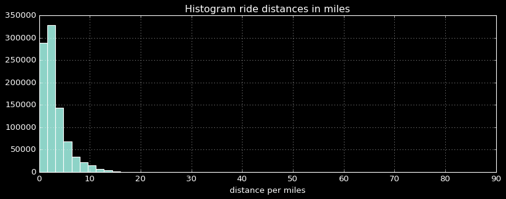
```python

df.groupby('passenger_count')['trip_distance', 'fare_amount'].mean()
```


<div>
<style scoped>
    .dataframe tbody tr th:only-of-type {
        vertical-align: middle;
    }

    .dataframe tbody tr th {
        vertical-align: top;
    }

    .dataframe thead th {
        text-align: right;
    }
</style>
<table border="1" class="dataframe">
  <thead>
    <tr style="text-align: right;">
      <th></th>
      <th>trip_distance</th>
      <th>fare_amount</th>
    </tr>
    <tr>
      <th>passenger_count</th>
      <th></th>
      <th></th>
    </tr>
  </thead>
  <tbody>
    <tr>
      <th>0</th>
      <td>0.005188</td>
      <td>60.000000</td>
    </tr>
    <tr>
      <th>1</th>
      <td>2.987959</td>
      <td>10.788808</td>
    </tr>
    <tr>
      <th>2</th>
      <td>3.188892</td>
      <td>11.604950</td>
    </tr>
    <tr>
      <th>3</th>
      <td>3.085856</td>
      <td>11.377877</td>
    </tr>
    <tr>
      <th>4</th>
      <td>3.193081</td>
      <td>11.951667</td>
    </tr>
    <tr>
      <th>5</th>
      <td>3.657328</td>
      <td>15.513190</td>
    </tr>
    <tr>
      <th>6</th>
      <td>5.175653</td>
      <td>26.255000</td>
    </tr>
  </tbody>
</table>
</div>


```python
print("Average $USD/Mile(Km) : {:0.2f}".format(df.fare_amount.sum()/df.trip_distance.sum()))
```

    Average $USD/Mile(Km) : 3.62
    


```python
df.head()
```


<div>
<style scoped>
    .dataframe tbody tr th:only-of-type {
        vertical-align: middle;
    }

    .dataframe tbody tr th {
        vertical-align: top;
    }

    .dataframe thead th {
        text-align: right;
    }
</style>
<table border="1" class="dataframe">
  <thead>
    <tr style="text-align: right;">
      <th></th>
      <th>medallion</th>
      <th>hack_license</th>
      <th>vendor_id</th>
      <th>rate_code</th>
      <th>store_and_fwd_flag</th>
      <th>pickup_datetime</th>
      <th>dropoff_datetime</th>
      <th>passenger_count</th>
      <th>trip_time_in_secs</th>
      <th>trip_distance</th>
      <th>...</th>
      <th>dropoff_dist_JFK</th>
      <th>pickup_dist_LGA</th>
      <th>dropoff_dist_LGA</th>
      <th>pickup_dist_EWR</th>
      <th>dropoff_dist_EWR</th>
      <th>pickup_dist_MNT</th>
      <th>dropoff_dist_MNT</th>
      <th>pickup_dist_Cenpark</th>
      <th>dropoff_dist_Cenpark</th>
      <th>direction</th>
    </tr>
  </thead>
  <tbody>
    <tr>
      <th>0</th>
      <td>89D227B655E5C82AECF13C3F540D4CF4</td>
      <td>BA96DE419E711691B9445D6A6307C170</td>
      <td>CMT</td>
      <td>1</td>
      <td>0</td>
      <td>2013-01-01 15:11:48</td>
      <td>2013-01-01 15:18:10</td>
      <td>4</td>
      <td>382</td>
      <td>1.241150</td>
      <td>...</td>
      <td>21.398754</td>
      <td>9.210086</td>
      <td>10.311332</td>
      <td>18.618462</td>
      <td>17.415033</td>
      <td>2.877828</td>
      <td>3.925015</td>
      <td>2.032320</td>
      <td>3.271972</td>
      <td>120.365644</td>
    </tr>
    <tr>
      <th>1</th>
      <td>0BD7C8F5BA12B88E0B67BED28BEA73D8</td>
      <td>9FD8F69F0804BDB5549F40E9DA1BE472</td>
      <td>CMT</td>
      <td>1</td>
      <td>0</td>
      <td>2013-01-06 00:18:35</td>
      <td>2013-01-06 00:22:54</td>
      <td>1</td>
      <td>259</td>
      <td>2.337508</td>
      <td>...</td>
      <td>21.693557</td>
      <td>12.276785</td>
      <td>10.707449</td>
      <td>15.334121</td>
      <td>17.031486</td>
      <td>6.491228</td>
      <td>4.156837</td>
      <td>5.791829</td>
      <td>3.616037</td>
      <td>-32.743231</td>
    </tr>
    <tr>
      <th>2</th>
      <td>0BD7C8F5BA12B88E0B67BED28BEA73D8</td>
      <td>9FD8F69F0804BDB5549F40E9DA1BE472</td>
      <td>CMT</td>
      <td>1</td>
      <td>0</td>
      <td>2013-01-05 18:49:41</td>
      <td>2013-01-05 18:54:23</td>
      <td>1</td>
      <td>282</td>
      <td>1.378441</td>
      <td>...</td>
      <td>21.471899</td>
      <td>11.902951</td>
      <td>12.759166</td>
      <td>15.705027</td>
      <td>14.896237</td>
      <td>5.828596</td>
      <td>7.183328</td>
      <td>5.200172</td>
      <td>6.448607</td>
      <td>156.598540</td>
    </tr>
    <tr>
      <th>3</th>
      <td>DFD2202EE08F7A8DC9A57B02ACB81FE2</td>
      <td>51EE87E3205C985EF8431D850C786310</td>
      <td>CMT</td>
      <td>1</td>
      <td>0</td>
      <td>2013-01-07 23:54:15</td>
      <td>2013-01-07 23:58:20</td>
      <td>2</td>
      <td>244</td>
      <td>0.855882</td>
      <td>...</td>
      <td>21.578941</td>
      <td>8.882869</td>
      <td>9.737594</td>
      <td>18.981752</td>
      <td>18.179745</td>
      <td>2.604538</td>
      <td>2.914919</td>
      <td>1.662560</td>
      <td>2.394821</td>
      <td>93.180439</td>
    </tr>
    <tr>
      <th>4</th>
      <td>DFD2202EE08F7A8DC9A57B02ACB81FE2</td>
      <td>51EE87E3205C985EF8431D850C786310</td>
      <td>CMT</td>
      <td>1</td>
      <td>0</td>
      <td>2013-01-07 23:25:03</td>
      <td>2013-01-07 23:34:24</td>
      <td>1</td>
      <td>560</td>
      <td>2.220446</td>
      <td>...</td>
      <td>22.100266</td>
      <td>9.264909</td>
      <td>11.438738</td>
      <td>18.368976</td>
      <td>16.282786</td>
      <td>3.881317</td>
      <td>4.784705</td>
      <td>2.752913</td>
      <td>4.351291</td>
      <td>91.511351</td>
    </tr>
  </tbody>
</table>
<p>5 rows × 43 columns</p>
</div>